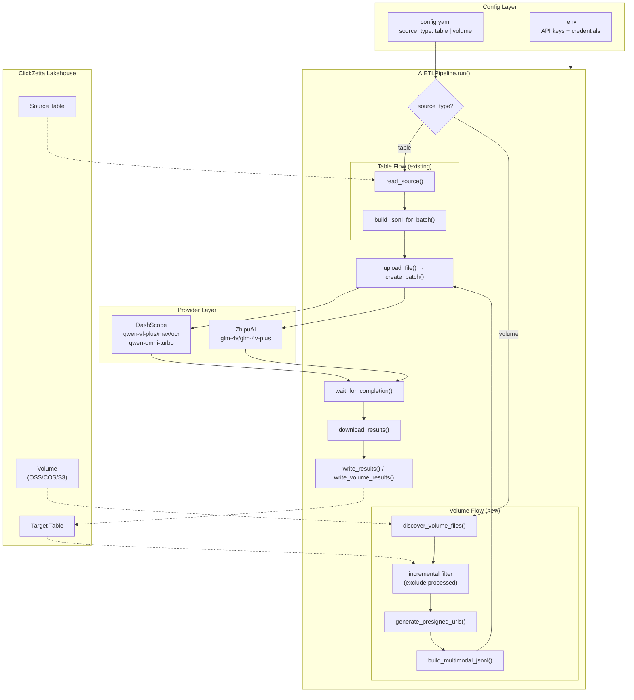

# Design: Multimodal AI ETL

## Overview

This design extends the existing AI ETL framework to support multimodal data sources from ClickZetta Lakehouse Volumes. The current system handles text-only ETL from Lakehouse tables; this upgrade adds a parallel Volume-based pipeline that discovers files (images, videos, audio), generates presigned URLs, constructs multimodal JSONL for batch inference, and writes results back with file metadata.

The design follows a **unified pipeline with branching data flow** pattern: the `AIETLPipeline` orchestrates both table and Volume flows, branching at the source-reading step based on `source_type` configuration. Both flows converge at the batch submission, polling, and result-writing stages.

Key design decisions:
- **Extend, don't fork**: Existing modules (`Config`, `LakehouseClient`, `Pipeline`) gain new methods rather than creating parallel classes. This keeps the codebase small and avoids duplication.
- **Provider-aware JSONL construction**: A new `MediaTypeMapper` handles the differences in multimodal content format between DashScope and ZhipuAI.
- **Incremental discovery via SQL**: Compare Volume directory listing against the target table's `file_path` column using a single SQL anti-join pattern, keeping the logic server-side.

## Architecture



## Components and Interfaces

### 1. Config Changes (`ai_etl/config.py`)

Add new properties to the `Config` class for Volume source configuration:

```python
class Config:
    # ... existing properties ...

    # ── Source Type ────────────────────────────────────────────
    @property
    def etl_source_type(self) -> str:
        """'table' (default) or 'volume'."""
        return self._get_nested("etl", "source", "source_type", default="table")

    # ── Volume Source ─────────────────────────────────────────
    @property
    def etl_source_volume_name(self) -> str:
        return self._get_nested("etl", "source", "volume_name", default="")

    @property
    def etl_source_file_types(self) -> list[str]:
        """List of extensions like ['.jpg', '.png']. Empty = all files."""
        val = self._get_nested("etl", "source", "file_types", default=[])
        if isinstance(val, str):
            return [e.strip() for e in val.split(",") if e.strip()]
        return val or []

    @property
    def etl_source_subdirectory(self) -> str:
        return self._get_nested("etl", "source", "subdirectory", default="")

    @property
    def etl_source_url_expiration(self) -> int:
        return int(self._get_nested("etl", "source", "url_expiration", default=86400))

    @property
    def etl_source_user_prompt(self) -> str:
        return self._get_nested("etl", "source", "user_prompt", default="Describe this file")
```

**Config YAML schema addition** — provider sections gain a `multimodal_model` field, and `etl.source` gains Volume-specific fields:

```yaml
# ── Provider 配置 ──────────────────────────────────────────
provider: dashscope

dashscope:
  # Text models (source_type: table)
  model: qwen3.5-flash
  # Multimodal models (source_type: volume)
  multimodal_model: qwen-vl-plus
  # Shared
  endpoint: /v1/chat/completions
  completion_window: "24h"
  poll_interval: 300.0

zhipuai:
  model: glm-4-flash
  multimodal_model: glm-4v-plus
  endpoint: /v4/chat/completions
  poll_interval: 300.0

# ── ETL 配置 ───────────────────────────────────────────────
etl:
  source:
    source_type: "volume"            # "table" | "volume"

    # ── Table mode fields (source_type: table) ──
    table: "schema.source_table"     # Source table name
    key_columns: "id"                # Primary key column(s), comma-separated
    text_column: "content"           # Text column for inference input
    filter: ""                       # SQL WHERE clause (without WHERE keyword)

    # ── Volume mode fields (source_type: volume) ──
    volume_name: "my_oss_volume"     # Volume name, e.g. "my_vol" or "USER VOLUME"
    file_types: [".jpg", ".png"]     # File extension filter (empty = all files)
    subdirectory: "images/2024/"     # Path prefix filter (empty = root)
    url_expiration: 86400            # Presigned URL TTL in seconds (default 24h)

    # ── Shared fields ──
    batch_size: 1000                 # Max rows/files per batch (0 = unlimited)
    system_prompt: "You are a helpful assistant."  # System message for LLM
    user_prompt: "Describe this image in detail"   # User instruction (volume mode)
    # Note: In table mode, user_prompt is ignored; the text_column value is the user input.
    # Note: In volume mode, system_prompt + user_prompt + file content form the full request.

  target:
    table: "schema.target_table"     # Target table name
    result_column: "ai_result"       # Column for inference result text
    write_mode: "append"             # "append" | "overwrite"
    # Note: Target table schema differs by source_type:
    #   table mode:  key_columns + result_column + 12 metadata columns
    #   volume mode: file_path + volume_name + file_size + result_column + 12 metadata columns
    # Missing columns are auto-created via ALTER TABLE ADD COLUMN.
```

**Model selection logic** in Config:

```python
    @property
    def multimodal_model(self) -> str:
        """Current provider's multimodal model."""
        p = self.provider_name
        val = self._get(p, "multimodal_model")
        if val:
            return val
        # Fallback defaults
        defaults = {"dashscope": "qwen-vl-plus", "zhipuai": "glm-4v-plus"}
        return defaults.get(p, "")

    def resolve_model(self, source_type: str) -> str:
        """Select model based on source_type: text model for table, multimodal for volume."""
        if source_type == "volume":
            return self.multimodal_model
        return self.model_name
```

### 2. LakehouseClient Extensions (`ai_etl/lakehouse.py`)

Three new public methods on `LakehouseClient`:

#### 2.1 `discover_volume_files()`

```python
def discover_volume_files(
    self,
    volume_name: Optional[str] = None,
    file_types: Optional[List[str]] = None,
    subdirectory: Optional[str] = None,
    target_table: Optional[str] = None,
    batch_size: Optional[int] = None,
) -> List[Dict[str, Any]]:
    """Discover new files in a Volume, excluding already-processed ones.

    Returns list of dicts with keys: relative_path, size
    """
```

**Algorithm**:
1. Execute `ALTER VOLUME <volume_name> REFRESH` to sync directory metadata
2. Query `SELECT relative_path, size FROM DIRECTORY(VOLUME <volume_name>)`
3. Filter by `file_types` (case-insensitive extension match) if configured
4. Filter by `subdirectory` prefix if configured
5. Query target table: `SELECT DISTINCT file_path FROM <target_table>` (wrapped in try/except for table-not-exists)
6. Exclude files already in target table (Python set difference on `relative_path`)
7. If zero new files remain, log info and return `[]`
8. Apply `batch_size` limit if configured and > 0
9. Return list of `{relative_path, size}` dicts

#### 2.2 `generate_presigned_urls()`

```python
def generate_presigned_urls(
    self,
    files: List[Dict[str, Any]],
    volume_name: Optional[str] = None,
    expiration: Optional[int] = None,
) -> List[Dict[str, Any]]:
    """Generate presigned URLs for Volume files.

    Returns list of dicts with keys: relative_path, size, presigned_url
    """
```

**Algorithm**:
1. Execute `SET cz.sql.function.get.presigned.url.force.external=true`
2. For each batch of files (batch SQL to avoid query size limits):
   - Build SQL: `SELECT relative_path, GET_PRESIGNED_URL(VOLUME <volume_name>, relative_path, <expiration>) AS url FROM (VALUES ...) AS t(relative_path)`
   - Or iterate per-file if batch syntax is unsupported: `SELECT GET_PRESIGNED_URL(VOLUME <volume_name>, '<path>', <expiration>)`
3. Skip files where URL is null (log warning)
4. Return enriched file list with `presigned_url` added

#### 2.3 `build_multimodal_jsonl()`

```python
def build_multimodal_jsonl(
    self,
    files: List[Dict[str, Any]],
    model: Optional[str] = None,
    user_prompt: Optional[str] = None,
    provider_name: Optional[str] = None,
    endpoint: str = "/v1/chat/completions",
    output_path: Optional[Union[str, Path]] = None,
) -> Path:
    """Build JSONL with multimodal content parts for batch inference."""
```

Delegates media type mapping to `MediaTypeMapper`.

#### 2.4 `write_volume_results()`

```python
def write_volume_results(
    self,
    results: List[Dict[str, Any]],
    volume_name: str,
    file_metadata: Dict[str, Dict[str, Any]],
    target_table: Optional[str] = None,
    result_column: Optional[str] = None,
    write_mode: Optional[str] = None,
    provider_name: str = "",
    batch_id: str = "",
    include_metadata: bool = True,
) -> int:
    """Write Volume inference results with file metadata columns."""
```

### 3. MediaTypeMapper (new: `ai_etl/media_types.py`)

A pure-function module that maps file extensions to media types and builds provider-specific content parts.

```python
from __future__ import annotations
from enum import Enum
from typing import Any, Dict, List, Optional

class MediaType(Enum):
    IMAGE = "image"
    VIDEO = "video"
    AUDIO = "audio"
    UNKNOWN = "unknown"

# Extension → MediaType mapping
EXTENSION_MAP: Dict[str, MediaType] = {
    ".jpg": MediaType.IMAGE, ".jpeg": MediaType.IMAGE,
    ".png": MediaType.IMAGE, ".gif": MediaType.IMAGE,
    ".bmp": MediaType.IMAGE, ".webp": MediaType.IMAGE,
    ".tiff": MediaType.IMAGE,
    ".mp4": MediaType.VIDEO, ".avi": MediaType.VIDEO,
    ".mov": MediaType.VIDEO, ".mkv": MediaType.VIDEO,
    ".webm": MediaType.VIDEO,
    ".mp3": MediaType.AUDIO, ".wav": MediaType.AUDIO,
    ".flac": MediaType.AUDIO, ".ogg": MediaType.AUDIO,
    ".m4a": MediaType.AUDIO,
}

# Provider → supported MediaTypes
PROVIDER_MEDIA_SUPPORT: Dict[str, set[MediaType]] = {
    "dashscope": {MediaType.IMAGE, MediaType.VIDEO, MediaType.AUDIO},
    "zhipuai": {MediaType.IMAGE, MediaType.VIDEO},
}

# DashScope multimodal models
DASHSCOPE_MULTIMODAL_MODELS = {
    "qwen-vl-plus", "qwen-vl-max", "qwen-vl-ocr", "qwen-omni-turbo",
    "qwen3-vl-plus", "qwen3-vl-flash", "qwen3.5-plus", "qwen3.5-flash",
}

# ZhipuAI multimodal models
ZHIPUAI_MULTIMODAL_MODELS = {
    "glm-4v", "glm-4v-plus",
}


def detect_media_type(file_path: str) -> MediaType:
    """Detect media type from file extension (case-insensitive)."""
    ext = "." + file_path.rsplit(".", 1)[-1].lower() if "." in file_path else ""
    return EXTENSION_MAP.get(ext, MediaType.UNKNOWN)


def build_content_parts(
    presigned_url: str,
    media_type: MediaType,
    user_prompt: str,
    provider_name: str,
) -> Optional[List[Dict[str, Any]]]:
    """Build provider-specific multimodal content parts.

    Returns None if the provider doesn't support this media type.
    """
    supported = PROVIDER_MEDIA_SUPPORT.get(provider_name, set())
    if media_type not in supported:
        return None

    parts: List[Dict[str, Any]] = []

    if media_type == MediaType.IMAGE:
        # Both DashScope and ZhipuAI use OpenAI-compatible image_url format
        parts.append({
            "type": "image_url",
            "image_url": {"url": presigned_url},
        })

    elif media_type == MediaType.VIDEO:
        if provider_name == "dashscope":
            # DashScope uses video_url type (OpenAI-compatible extension)
            parts.append({
                "type": "video_url",
                "video_url": {"url": presigned_url},
            })
        elif provider_name == "zhipuai":
            # ZhipuAI uses a different video format
            parts.append({
                "type": "video_url",
                "video_url": {"url": presigned_url},
            })

    elif media_type == MediaType.AUDIO:
        if provider_name == "dashscope":
            # DashScope Qwen-Omni uses input_audio type
            parts.append({
                "type": "input_audio",
                "input_audio": {"url": presigned_url},
            })
        else:
            return None  # ZhipuAI doesn't support audio in batch

    # Always append the text prompt
    parts.append({"type": "text", "text": user_prompt})

    return parts


def is_provider_supported(media_type: MediaType, provider_name: str) -> bool:
    """Check if a provider supports a given media type."""
    return media_type in PROVIDER_MEDIA_SUPPORT.get(provider_name, set())
```

### 4. Result Keys Extension (`ai_etl/result_keys.py`)

Add Volume-specific column constants:

```python
# ── Volume result columns ─────────────────────────────────────
FILE_PATH = "file_path"
VOLUME_NAME = "volume_name"
FILE_SIZE = "file_size"

VOLUME_COLUMNS = [FILE_PATH, VOLUME_NAME, FILE_SIZE]

VOLUME_SQL_TYPES = {
    FILE_PATH: "STRING",
    VOLUME_NAME: "STRING",
    FILE_SIZE: "BIGINT",
}
```

### 5. Pipeline Orchestration (`ai_etl/pipeline.py`)

Extend `AIETLPipeline.run()` to branch on `source_type`:

```python
def run(self, source_type: Optional[str] = None, **kwargs) -> Dict[str, Any]:
    source_type = source_type or self._config.etl_source_type

    if source_type == "volume":
        return self._run_volume(**kwargs)
    else:
        return self._run_table(**kwargs)  # existing logic, extracted

def _run_volume(
    self,
    volume_name: Optional[str] = None,
    file_types: Optional[List[str]] = None,
    target_table: Optional[str] = None,
    model: Optional[str] = None,
    provider_name: Optional[str] = None,
    **kwargs,
) -> Dict[str, Any]:
    """Volume ETL flow: discover → filter → URLs → JSONL → batch → write."""
    cfg = self._config
    volume_name = volume_name or cfg.etl_source_volume_name
    provider_name = provider_name or cfg.provider_name

    if not volume_name:
        raise RuntimeError("Volume name required. Set etl.source.volume_name in config.yaml or pass --volume-name.")

    provider = self._resolve_provider(provider_name)
    resolved_model, _ = self._resolve_model_and_prompt(provider.name, model)

    # Step 1: Discover new files
    files = self._lakehouse.discover_volume_files(
        volume_name=volume_name,
        file_types=file_types or cfg.etl_source_file_types,
        subdirectory=cfg.etl_source_subdirectory,
        target_table=target_table or cfg.etl_target_table,
        batch_size=cfg.etl_source_batch_size,
    )
    if not files:
        return self._make_stats(0, provider.name, resolved_model)

    # Step 2: Generate presigned URLs
    files_with_urls = self._lakehouse.generate_presigned_urls(
        files, volume_name=volume_name,
        expiration=cfg.etl_source_url_expiration,
    )

    # Warn if URL expiration < completion_window
    self._check_url_expiration_warning(cfg)

    # Step 3: Build multimodal JSONL
    jsonl_path = self._lakehouse.build_multimodal_jsonl(
        files_with_urls,
        model=resolved_model,
        user_prompt=cfg.etl_source_user_prompt,
        provider_name=provider.name,
        endpoint=provider.build_jsonl_endpoint(),
    )

    # Step 4: Submit batch
    file_id = provider.upload_file(jsonl_path)
    batch_id = provider.create_batch(file_id, task_name=f"ai-etl-volume-{volume_name}")

    # Persist state for resume
    self._save_batch_state(batch_id, provider.name, resolved_model,
                           source_type="volume", volume_name=volume_name,
                           discovered=len(files), new_files=len(files_with_urls))

    # Step 5: Wait and download
    provider.wait_for_completion(batch_id)
    result_text = provider.download_results(batch_id)
    results = BatchProvider.parse_results(result_text) if result_text else []

    # Step 6: Write results with file metadata
    file_metadata = {f["relative_path"]: f for f in files_with_urls}
    written = self._lakehouse.write_volume_results(
        results, volume_name=volume_name,
        file_metadata=file_metadata,
        target_table=target_table,
        provider_name=provider.name,
        batch_id=batch_id,
    ) if results else 0

    return self._make_volume_stats(...)
```

### 6. CLI Extensions (`ai_etl/__main__.py`)

Add Volume-specific arguments to the `run` subcommand:

```python
run_p.add_argument("--source-type", choices=["table", "volume"],
                   help="Data source type")
run_p.add_argument("--volume-name", help="Volume name for volume source")
run_p.add_argument("--file-types", help="Comma-separated file extensions (e.g. .jpg,.png)")
```

Validation: if `--source-type volume` is specified without `volume_name` (CLI or config), exit with error.

## Data Models

### Volume Discovery Result

```python
@dataclass
class VolumeFile:
    relative_path: str    # e.g. "images/photo_001.jpg"
    size: int             # file size in bytes
    presigned_url: str    # populated after URL generation
```

In practice, represented as `Dict[str, Any]` for consistency with existing patterns.

### Target Table Schema for Volume Sources

```sql
CREATE TABLE IF NOT EXISTS <target_table> (
    file_path       STRING,       -- relative_path from Volume
    volume_name     STRING,       -- configured Volume name
    file_size       BIGINT,       -- file size in bytes
    ai_result       STRING,       -- inference result (configurable column name)
    -- Standard metadata columns (same as table ETL):
    model           STRING,
    provider        STRING,
    prompt_tokens   INT,
    completion_tokens INT,
    total_tokens    INT,
    batch_id        STRING,
    processed_at    STRING,
    status_code     INT,
    finish_reason   STRING,
    response_id     STRING,
    source_text     STRING,       -- will contain the user_prompt
    raw_response    STRING
)
```

### JSONL Record Format

**DashScope — Image:**
```json
{
  "custom_id": "req-images/photo_001.jpg",
  "method": "POST",
  "url": "/v1/chat/completions",
  "body": {
    "model": "qwen-vl-plus",
    "messages": [
      {
        "role": "user",
        "content": [
          {"type": "image_url", "image_url": {"url": "https://...presigned..."}},
          {"type": "text", "text": "Describe this image"}
        ]
      }
    ]
  }
}
```

**DashScope — Video:**
```json
{
  "custom_id": "req-videos/clip_001.mp4",
  "method": "POST",
  "url": "/v1/chat/completions",
  "body": {
    "model": "qwen-vl-plus",
    "messages": [
      {
        "role": "user",
        "content": [
          {"type": "video_url", "video_url": {"url": "https://...presigned..."}},
          {"type": "text", "text": "Describe this video"}
        ]
      }
    ]
  }
}
```

**DashScope — Audio (qwen-omni-turbo):**
```json
{
  "custom_id": "req-audio/recording_001.mp3",
  "method": "POST",
  "url": "/v1/chat/completions",
  "body": {
    "model": "qwen-omni-turbo",
    "messages": [
      {
        "role": "user",
        "content": [
          {"type": "input_audio", "input_audio": {"url": "https://...presigned..."}},
          {"type": "text", "text": "Transcribe this audio"}
        ]
      }
    ]
  }
}
```

**ZhipuAI — Image:**
```json
{
  "custom_id": "req-images/photo_001.jpg",
  "method": "POST",
  "url": "/v4/chat/completions",
  "body": {
    "model": "glm-4v-plus",
    "messages": [
      {
        "role": "user",
        "content": [
          {"type": "image_url", "image_url": {"url": "https://...presigned..."}},
          {"type": "text", "text": "Describe this image"}
        ]
      }
    ]
  }
}
```

**ZhipuAI — Video:**
```json
{
  "custom_id": "req-videos/clip_001.mp4",
  "method": "POST",
  "url": "/v4/chat/completions",
  "body": {
    "model": "glm-4v-plus",
    "messages": [
      {
        "role": "user",
        "content": [
          {"type": "video_url", "video_url": {"url": "https://...presigned..."}},
          {"type": "text", "text": "Describe this video"}
        ]
      }
    ]
  }
}
```

### Data Flow Comparison

| Step | Table ETL | Volume ETL |
|------|-----------|------------|
| Source | `SELECT key, text FROM table` | `DIRECTORY(VOLUME name)` |
| Filter | `WHERE filter_expr` | Extension + subdirectory + incremental |
| Key encoding | Internal request ID encodes primary key | Internal request ID encodes file path |
| Content | Text-only `messages` | Multimodal `content` parts |
| URL generation | N/A | `GET_PRESIGNED_URL()` |
| Target schema | key_cols + result + metadata | file_path + volume_name + file_size + result + metadata |
| Result mapping | Decode request ID → key columns | Decode request ID → file_path |


## Correctness Properties

*A property is a characteristic or behavior that should hold true across all valid executions of a system — essentially, a formal statement about what the system should do. Properties serve as the bridge between human-readable specifications and machine-verifiable correctness guarantees.*

### Property 1: Config file_types normalization

*For any* `file_types` configuration value — whether a Python list of strings, a comma-separated string, or an empty/null value — `Config.etl_source_file_types` SHALL return a normalized Python list of stripped, non-empty extension strings.

**Validates: Requirements 1.4**

### Property 2: File extension filtering preserves only matching types

*For any* list of file paths and any non-empty set of target extensions, filtering by `file_types` SHALL return only files whose extension (case-insensitive) is in the target set, and SHALL include every file that matches.

**Validates: Requirements 2.3**

### Property 3: Subdirectory prefix filtering preserves only matching paths

*For any* list of file paths and any subdirectory prefix string, filtering by subdirectory SHALL return only files whose `relative_path` starts with the prefix, and SHALL include every file that matches.

**Validates: Requirements 2.4**

### Property 4: Incremental discovery excludes all processed files

*For any* set of discovered file paths and any set of already-processed file paths, the incremental filter SHALL return exactly the set difference: files in discovered but not in processed. No processed file SHALL appear in the result, and no unprocessed file SHALL be excluded.

**Validates: Requirements 2.6**

### Property 5: Batch size limiting

*For any* list of files and any positive `batch_size`, the result of applying the batch size limit SHALL have length ≤ `batch_size`, and when the input list is longer than `batch_size`, the result length SHALL equal `batch_size`.

**Validates: Requirements 2.8**

### Property 6: Media type mapping produces correct provider-specific content parts

*For any* file with a known extension and any supported provider, `build_content_parts()` SHALL return content parts matching the provider's expected format for that media type (image_url for images, video_url for videos, input_audio for DashScope audio). *For any* file whose media type is not supported by the provider, `build_content_parts()` SHALL return None.

**Validates: Requirements 4.1, 4.2, 4.3, 4.8**

### Property 7: Text prompt is always included in multimodal content

*For any* file and any non-empty user prompt, when `build_content_parts()` returns a non-None result, the last element of the content parts list SHALL be a text part containing the exact user prompt string.

**Validates: Requirements 4.4**

### Property 8: Request ID round-trip for file paths

*For any* valid file relative_path string, encoding it as a request ID and then decoding SHALL recover the original relative_path. This ensures results can always be traced back to source files.

**Validates: Requirements 4.5, 5.2**

### Property 9: Volume result mapping preserves file metadata

*For any* inference result with a valid request ID encoding a file path, and any file metadata dict mapping that path to `{size, volume_name}`, the `write_volume_results()` output row SHALL contain the correct `file_path`, `volume_name`, and `file_size` values matching the original discovery data.

**Validates: Requirements 5.3**

## Error Handling

| Scenario | Handling |
|----------|----------|
| `source_type=volume` but `volume_name` empty | Raise `RuntimeError` with clear message at pipeline start |
| `ALTER VOLUME REFRESH` fails | Log warning, continue with potentially stale directory listing |
| `DIRECTORY(VOLUME ...)` returns empty | Log info "No files found in Volume", return empty list |
| Target table doesn't exist for incremental query | Catch exception, treat as "no processed files" (all files are new) |
| `GET_PRESIGNED_URL` returns null for a file | Log warning with file path, skip that file |
| All presigned URLs are null | Raise `LakehouseError("No valid presigned URLs generated")` |
| File media type not supported by provider | Log warning, skip file, continue with remaining files |
| All files skipped (unsupported types) | Raise `LakehouseError("No files with supported media types")` |
| JSONL line exceeds 6 MB | Skip line, log warning with file path |
| Total JSONL lines > 50,000 | Raise `LakehouseError` with batch_size suggestion |
| `url_expiration` < `completion_window` | Log warning about potential URL expiry during batch processing |
| Volume ETL resume | Load `source_type` from `last_batch.json`, use appropriate result writer |
| Unknown file extension | `detect_media_type()` returns `UNKNOWN`, file is skipped |

## Testing Strategy

### Unit Tests

Focus on specific examples and edge cases:

- **Config parsing**: Verify default values, type coercion, missing fields
- **CLI argument parsing**: Verify `--source-type`, `--volume-name`, `--file-types` are captured
- **CLI validation**: `--source-type volume` without volume_name exits with error
- **Edge cases**: Empty file list, all files already processed, all URLs null, oversized JSONL lines
- **Target table DDL**: Verify generated CREATE TABLE includes Volume-specific columns

### Property-Based Tests

Using `hypothesis` (Python PBT library), minimum 100 iterations per property:

| Property | What's Generated | What's Verified |
|----------|-----------------|-----------------|
| P1: file_types normalization | Random lists/strings/None | Normalized list output |
| P2: Extension filtering | Random file paths + extension sets | Only matching files returned |
| P3: Subdirectory filtering | Random paths + prefixes | Only prefix-matching files returned |
| P4: Incremental exclusion | Random discovered + processed sets | Exact set difference |
| P5: Batch size limiting | Random file lists + batch sizes | Length ≤ batch_size |
| P6: Media type mapping | Random extensions + providers | Correct content part format |
| P7: Text prompt inclusion | Random files + prompts | Text part always last |
| P8: Request ID round-trip | Random file path strings | Encode→decode = identity |
| P9: Result mapping | Random results + metadata | Correct field population |

Each property test tagged with: `# Feature: multimodal-ai-etl, Property N: <title>`

### Integration Tests

Mock-based tests for Lakehouse SQL interactions:

- `discover_volume_files()`: Verify SQL sequence (ALTER VOLUME REFRESH → DIRECTORY query → target table query)
- `generate_presigned_urls()`: Verify SET command → GET_PRESIGNED_URL SQL
- `write_volume_results()`: Verify table creation DDL, ALTER TABLE for missing columns
- Pipeline orchestration: Verify correct method call sequence for volume vs table flows
- Resume: Verify `last_batch.json` includes `source_type` and volume metadata
